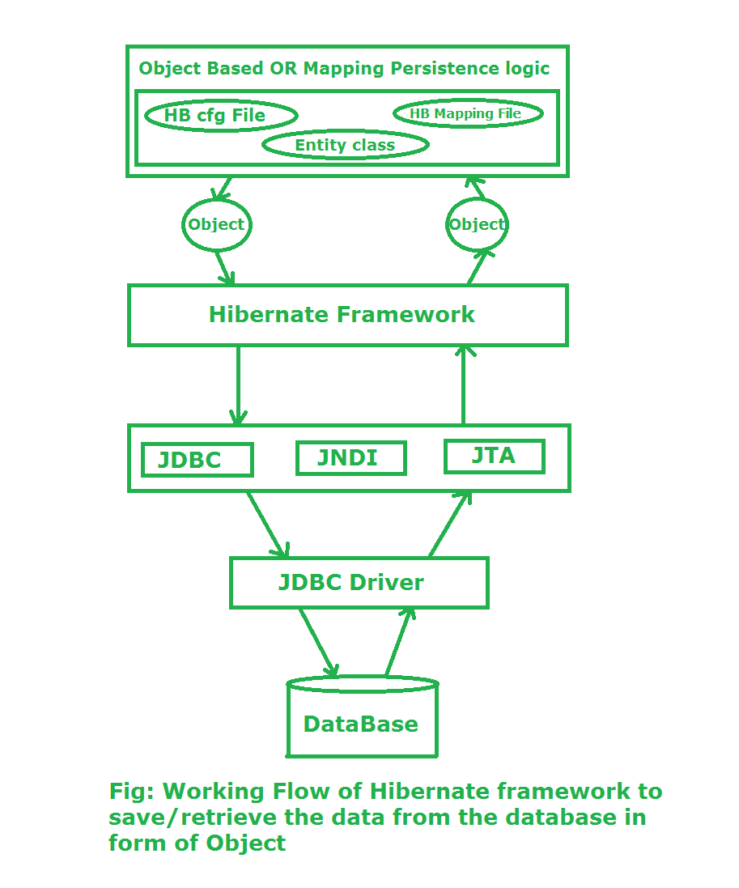

# Hibernate-tutorial

01. [Hibernate 01 - Begin MySQL](./01-begin-mysql/src/main/java/com/github/truongbb/mainrun/MainRun.java)
02. [Hibernate 02 - Begin Oracle](./02-begin-oracle/src/main/java/com/github/truongbb/run/MainRun.java)
03. [Hibernate 03 - Annotations](./03-annotation/src/main/java/com/github/truongbb/mainrun/MainRun.java)
04. [Hibernate 04 - Session](./04-session/README.md)
05. [Hibernate 05 - HQL and native SQL](./05-hql-and-native-sql/src/main/java/com/github/truongbb/dao/StudentDAO.java)
